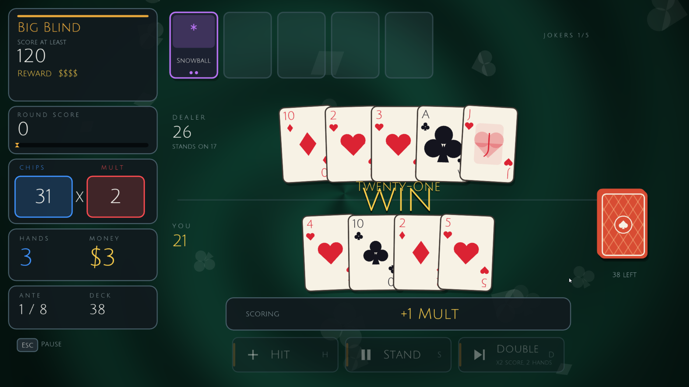

# 🃏 JOKER 21
 
**Blackjack with a few twists.**
 

 
[Getting Started](#-getting-started) •
[How to Play](#-how-to-play) •
[Controls](#-controls) •
[Project Structure](#-project-structure) •
[Contributing](#-contributing)
 

 
## About
 
**Joker 21** takes the classic game of blackjack and wraps it in the kind of run-based, progression-driven loop made popular by *Balatro*. Pick your blinds, take a seat at the table, beat the house, and spend your winnings in the shop before the next round.
 
Built from scratch in Lua with the [LÖVE](https://love2d.org/) framework.
 
##  Features
 
-  **Blackjack at the core**: familiar rules, with some twists layered on top
-  **Blinds and rounds**: a run-based structure inspired by Balatro
-  **Shop screen** between rounds
-  **Save system** so your progress sticks around
-  **Music and sound effects**
-  **Resizable window** with a scaled virtual canvas, plus fullscreen support
-  **Reduced motion option** for gentler screen transitions
-  **Animated transitions** (fade and iris wipe) and a custom animated background
##  Getting Started
 
### Run the game
 
Download the most recent release from this page, extract and run Joker21.exe.

##  How to Play
 
Joker 21 follows the standard blackjack goal: get as close to **21** as you can without going over, and beat the dealer's hand.
 
From the main menu, the **How to Play** screen covers the rules and the twists specific to this game. A typical run looks like this:
 
1. **Choose a blind** to take on
2. **Play at the table** and try to beat the dealer
3. **Visit the shop** to power up before the next round
4. Keep going until you lose it all, or clear the run
<!-- Add details on your specific twists here: special cards, jokers, modifiers, scoring, etc. -->
 
##  Controls
 
| Input | Action |
| --- | --- |
| **Mouse** | Navigate menus and interact with the table |
| `F11` | Toggle fullscreen |
| `F3` | Toggle FPS counter |
 
The window starts at **1280×720** and can be resized down to 960×540.
 
##  Contributing
 
Bug reports, ideas, and pull requests are welcome.
 
1. Fork the repo
2. Create a feature branch: `git checkout -b feature/my-idea`
3. Commit your changes: `git commit -m "Add my idea"`
4. Push the branch: `git push origin feature/my-idea`
5. Open a pull request

### Regression checks

From the repository root, run `lua tests/regression.lua`. The checks use an
in-memory filesystem and do not open a window or modify your game saves.
   
##  Acknowledgements
 
- [LÖVE](https://love2d.org/): the framework that makes this possible
- **Balatro** by LocalThunk: the inspiration for the game's structure and feel. Joker 21 is an unofficial fan project and is not affiliated with or endorsed by Balatro or its creators.

##  License
 
Distributed under the **MIT License**. See [`LICENSE`](LICENSE) for details.
 

Made with ♠️ ♥️ ♣️ ♦️ by [E560000](https://github.com/E560000)
 

